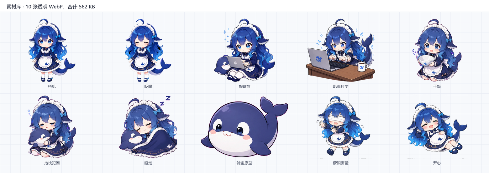
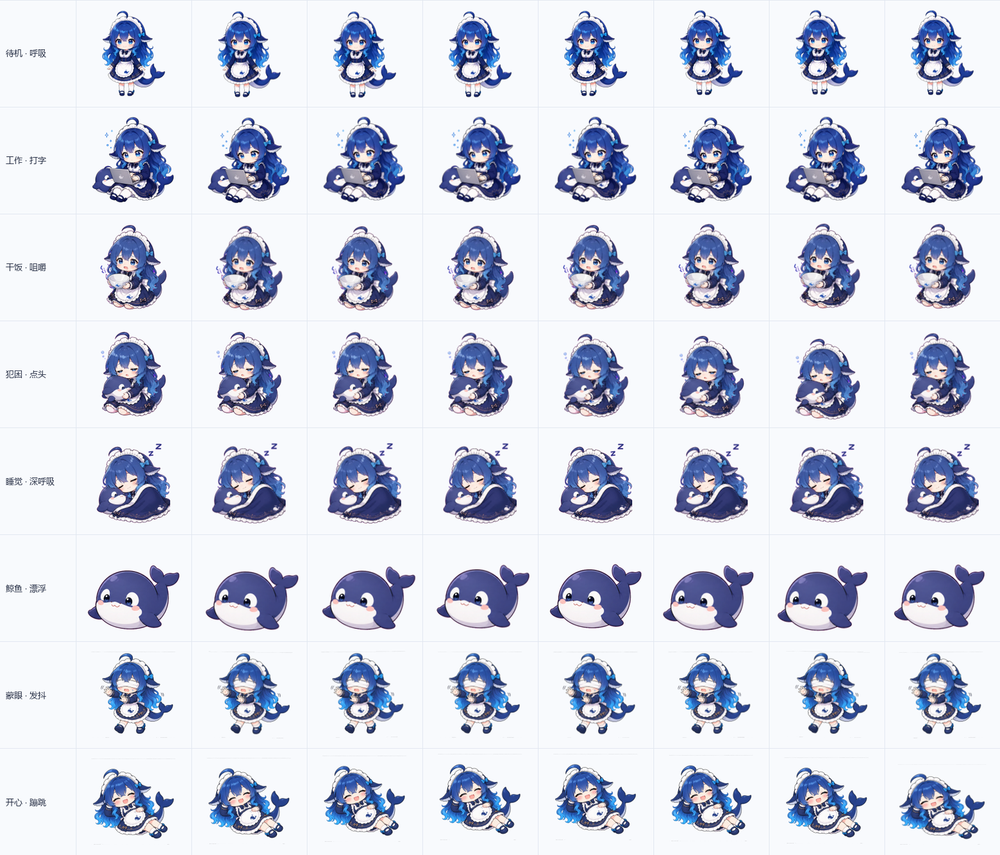

<!-- GH-ONLY:START 这一段只在 GitHub 上显示（横幅/截图/下载指引）。
     打包脚本会把 GH-ONLY 区间连同标记整段删掉，所以包内的 README 不会出现
     ./docs/ 这种包里不存在的相对路径。改这里不用同步改别处。 -->


**一只住在桌面右下角的女仆鲸鱼娘。** 轻量 · 纯本地 · 无联网 · 无后台服务。

10 套独立动效 · 15 条程序合成音效 · 59 条台词 · 22 MB 免安装。

| 想怎么用 | 下载哪个 |
|---|---|
| **马上用，什么都不装** | [`DeepSeek-WhaleMaidPet_1.0.0_selfcontained.zip`](https://github.com/AIR-pixel/deepseek-whale-maid-pet/releases/latest/download/DeepSeek-WhaleMaidPet_1.0.0_selfcontained.zip) · 21.8 MB |
| 机器上已有 Python 3.9+ | [`DeepSeek-WhaleMaidPet_1.0.0_source.zip`](https://github.com/AIR-pixel/deepseek-whale-maid-pet/releases/latest/download/DeepSeek-WhaleMaidPet_1.0.0_source.zip) · 727 KB |
| 读代码 / 自己改 | `git clone` 本仓库，见下面「[运行](#运行)」 |

> 附件名是 ASCII 的：GitHub 会把 Release 附件的 name 里**非 ASCII 字符替换成 `.`**
> （`DeepSeek鲸鱼娘桌宠_自包含_20260926.zip` 传上去会变成 `DeepSeek._._20260926.zip`），
> 所以这里换了英文名。**解压出来的目录名仍是中文** `DeepSeek鲸鱼娘桌宠`。
> 全部版本见 [Releases](https://github.com/AIR-pixel/deepseek-whale-maid-pet/releases)。

> 同人作品，**非商用**。代码 MIT、立绘素材 CC BY-NC-SA 4.0 —— 见「[署名与许可](#署名与许可)」。
> 程序部分由 **DeepSeek（DeepSeek-V4.1-Flash）** 辅助开发 —— 见「[开发说明](#开发说明)」。

## 它动起来是什么样


| 全部 10 个状态 | 各状态动效矩阵 |
|---|---|
|  |  |

尺寸阶梯（80–560 每档实测）与音效波形：`docs/size-ladder.png`、`docs/sfx-waveform.png`。

<!-- GH-ONLY:END -->

# DeepSeek 鲸鱼娘 · 桌面宠物

一只住在桌面右下角的女仆鲸鱼娘。轻量、纯本地、无联网、无后台服务。

体积构成：立绘 562 KB + 音效 149 KB + 代码约 55 KB。

## 运行

双击 **`启动桌宠.bat`**。

依赖：Python 3.9+ 与 `pip install pyqt5`（音效用 `PyQt5.QtMultimedia`，
属于 pyqt5 的一部分，无需额外安装）。启动器按这个顺序找解释器：

1. **`DPET_PYW` 环境变量** —— 显式指定，优先级最高（开发/验收用）
2. 同目录 **`runtime\pythonw.exe`** —— 塞一个便携 Python 进去就能完全自包含
3. PATH 上的 **`pythonw` → `python`**
4. **`py -3`** 启动器 —— 取它解释器旁边的 `pythonw.exe`

找到后**预检 `import PyQt5`**，缺库时打印当前用的是哪个解释器并给出安装命令，
不会静默失败。若某台机器上 QtMultimedia 后端不可用，音效菜单项会**置灰并给出原因**，
桌宠照常运行。

> 启动器是**纯 ASCII + CRLF** 写的：cmd 按 GBK 解析 UTF-8 中文会字节错位，
> 导致一堆"不是内部或外部命令"。改这个 `.bat` 时**不要往里写中文**。

## 交互

| 操作 | 效果 |
|---|---|
| 左键拖拽 | 移动位置（自动记忆） |
| 单击 | 随机反应：开心 / 蒙眼害羞 / 变回鲸鱼原型 / 干饭 / 说句话 |
| 双击 | 蹦一下并吐槽 |
| 滚轮 | 缩放大小（**80–560**；低于 240 时步长自动降到 10px，方便微调小尺寸） |
| 右键 | 功能菜单 |
| 托盘图标 | 单击显示/隐藏，右键菜单 |

右键菜单可调：大小（迷你 90 / 很小 130 / 小 190 / 标准 280 / 大 380 / 很大 460 / 超大 560）、
透明度、始终置顶、气泡开关、**交互音效开关 + 音量 + 试听**、喝水提醒、久坐提醒、
开机自启、回到右下角。

> 尺寸是**逻辑像素**。在 200% 缩放的屏幕上，"迷你 90" 实际占屏幕高度约 11%。
> 立绘按 2 倍分辨率渲染再由 Qt 缩放（超采样），所以调小不会糊。

## 音效

**15 条交互反馈音，共 149 KB**，全部由 `tools/make_sfx.py` **程序合成**——
不含任何采样素材，所以没有版权问题，风格不对改几个数字重跑即可。

| 时机 | 音 | 时机 | 音 |
|---|---|---|---|
| 启动问候 | `hello` 上行四音 | 点击 → 开心 | `happy` 大三和弦琶音 |
| 双击蹦跳 | `hop` E6→B6 | 点击 → 害羞 | `shy` 下滑小两度 + 颤音 |
| 拖拽拿起 / 放下 | `grab` / `drop` | 点击 → 变鲸鱼 | `whale` 下潜 + 气泡 |
| 滚轮放大 / 缩小 | `zoom_up` / `zoom_down` | 点击 → 干饭 | `eat` 两下咀嚼 |
| 气泡弹出 | `pop` 极短"啵" | 从打盹被叫醒 | `wake` 上行两音 |
| 单击兜底 / 菜单 | `click` | 开始干活 | `work` 键帽咔哒 |
| | | 喝水 / 久坐提醒 | `remind` 叮咚两下 |

三个实现要点：

- **`QSoundEffect` 是异步加载的**，未 Ready 时 `play()` 直接无效（不报错）。
  启动时一次性预载并等就绪（实测 132ms），否则"第一次点击没声音"。
- **全局最小间隔 110ms** 挡掉几乎同时触发的第二条。点击时状态音和气泡音会挨着触发，
  没有这道门就会叠成一声怪音。同一 cue 连打不用防抖——`QSoundEffect` 自己会合并。
- **自发小动作默认不出声**（`deepseek_pet.py` 的 `AUTO_CUE`）。需求是"交互反馈"，
  每几十秒自己响一声会变成噪音。想要"有生命感"把 `AUTO_CUE` 改成 `True`。

重新生成：`python tools/make_sfx.py`。改风格就调 `chime()` 的泛音比、滑音方向、
`env()` 的衰减曲线，以及 `CUES` 里每条的目标峰值。

## 动效

每个状态都有独立的运动曲线（`src/motion.py`），全部由**同一张立绘实时变换**得到，
帧间零漂移——不会像 AI 生成序列帧那样五官乱跳、描边闪烁。

| 状态 | 动效 |
|---|---|
| 待机 | 呼吸起伏（约 3.6s 一个来回）+ 随机眨眼 |
| 工作 | 敲键盘的双频脉冲律动 + 轻微左右摇 |
| 干饭 | 咀嚼节奏（约 1s 一回）+ 小幅点头 |
| 犯困 | 缓慢低头 → 猛地抬头，周期 3.4s |
| 睡觉 | 深呼吸，幅度大于待机 |
| 鲸鱼 | 水中漂浮：左右漂 + 上下浮 + 轻微摇摆 |
| 蒙眼 | 两个频率叠加的慌张发抖 |
| 开心 | 蹲下蓄力 → 跳起 → 落地缓冲 |

三个实现要点：

- 变换锚点是**脚底中心**——呼吸时脚不动、蹦跳时整个人离地、压扁时从脚底往上缩，
  不会出现"角色在窗口里乱飘"的廉价感。
- 幅度按 `实际高度 / 280` 等比缩放，滚轮能到的 **80–560 每一档都实测过不越界**，
  不会出现放下"超大"后跳到一半被窗口裁掉。
- 但等比缩放有**下限** `SCALE_MIN = 0.5`：再小就不继续缩了，否则"迷你 90"的呼吸
  只剩 1px 出头，肉眼等于静止。窗口边距有固定的 +12px 底数，所以钳住下限也不会越界。
- 窗口为动效预留边距（`12 + 高度 × 0.042`），遮罩用 8 方向膨胀，
  保证跳到最高点、摇到最歪时仍然点得到角色。

曲线**是数据，不是代码**：全部写在 `content/actions.json` 的 `motions` 段，
`src/motion.py` 只负责解释执行。这是「能从远端收到新动作」的前提——
加一个动作是加一段 JSON，不是改 Python、不是重新打包。

引擎只认下面这几个**具名原语**（不认识的一律跳过，所以新版本加的原语在旧程序上
只是不生效，不会崩）：

| 原语 | 含义 |
|---|---|
| `const` | 常量增量 |
| `sine` | 正弦，`sin(2π·t/period + phase) × amp` |
| `freq` | 按角频率振荡，`sin(omega·t) × amp` |
| `pulse_sum` | 多条周期脉冲求和后钳位——敲键盘那种"不规律的节奏感"就是它 |
| `sink` | 缓慢下沉 → 猛地抬头（犯困）；段点写死在引擎里 |
| `hop` | 蹲下蓄力 → 腾空 → 落地缓冲（开心）；输出哪一路由所在通道决定 |
| `ref` | 引用同素材里已算出的量（原语用 `save` 存，后面用 `{"k":"ref","sig":...}` 取） |

三个容易写错的地方：

- 通道求值顺序固定 `dy → dx → sx → sy → rot`，所以 `rot` 可以引用 `dx`，反过来不行。
- **缩放通道的基准是 1.0**，数据里不要再写 `const 1.0` —— 会叠加成 2.0。
- `sig` 只用来**取**，`save` 只用来**存**。早期两边都叫 `sig`，结果 `ref` 项自己也被
  当成一次声明，把上游信号覆盖成 0（犯困的旋转就是这么变成 0 的）。

数值含义是"280px 高度下的像素幅度"；`visual_scale`（在 `assets` 段里）用于配平
各素材的视觉体量——横躺的鲸鱼本来会显得比别人大一圈。

改完必须跑一次回归，它会逐点比对 10 个素材 × 6050 组采样：

```bash
python tools/motion_regression.py dump  ref.json    # 改之前先存基准
python tools/motion_regression.py check ref.json    # 改之后逐点比对
```

精度是**逐位相同**（`abs_tol=0`），不是"看起来差不多"。0.0001px 的偏差在小尺寸下
会被放大成肉眼可见的抖，靠看预览图发现不了。

## 它会自己做的事

- **时间问候**：按凌晨/早/午/下午/晚/深夜切换开场白
- **空闲感知**：读取系统键鼠空闲时间，超过 3 分钟抱枕犯困，超过 10 分钟睡着；你一回来就醒
- **自发小动作**：待机时会自己变回鲸鱼、开心一下或敲会儿键盘
- **学新动作**：收到远端下发的新内容后，等角色空闲下来会自己演一遍（见下一节）
- **台词**：59 条，围绕"聪明但懒、傲娇、爱吃白饭"的官方+社区设定

## 内容更新

桌宠可以在**启动时**检查一次远端有没有新内容（新动作、新台词），有就静默装好。
**零费用、零服务端**——内容直接放在本仓库的 `content/` 目录里。

### 为什么是"启动时查一次"

真·实时推送要长连接常驻（心跳、重连、还得维护一个服务端），对桌宠这种场景代价
远大于收益。这东西本来就是开机自启的，所以"每次启动查一次"在用户感知上和实时
没差别，代价是零——不新开定时器、不常驻联网。

### 三个免费通道，按顺序试

| 顺序 | 通道 | 特点 |
|---|---|---|
| 1 | `raw.githubusercontent.com` | 实时、无缓存延迟；国内链路时通时断 |
| 2 | `cdn.jsdelivr.net` | 全球 CDN，国内基本可达；代价是最长 12 小时缓存 |
| 3 | `cdn.gh-proxy.com` | 第三方镜像，兜底 |

顺序刻意把 raw 放第一：能直连的用户立刻拿到最新内容；不能的走 jsDelivr 也只是
慢半天，而"惊喜"不要求分钟级时效。三源全不通就当作离线，静默跳过——检查更新是
锦上添花，不是启动的必经环节。

### 安全边界（硬约束）

- **只下数据文件**（`.json` / `.webp`），其余扩展名一律拒绝。程序侧只解释数据、
  不执行任何下发内容——最坏情况是动作难看，不会变成执行任意代码。
- **清单里的路径必须相对、无 `..`**，挡住目录穿越。
- **每个文件校验 SHA256**，对不上整包丢弃。
- **先在暂存目录完整落盘并真实加载一次**，通过了才搬进正式目录。光校验哈希不够：
  清单本身漏写一个素材时每个文件都能对上哈希，但装上去的包是残的。
- **素材先写、`actions.json` 最后写**，索引文件落地时它引用到的素材必然已就位。

远端内容落在 `%LOCALAPPDATA%\DeepSeekPet\content\`（不是程序目录——程序可能装在
`Program Files` 下，那里对普通用户不可写，更新会静默失败）。

### 用户能控制什么

右键菜单 → **内容更新**：

- **接收新内容**：总开关。首次启动会先打一次招呼再联网，不会偷偷来。
- **立即检查**：手动查一次。内容坏了（被整包丢弃）时会强制重拉一遍，是救援手段。
- **回滚到自带内容**：删掉远端目录，退回内置的 8 个动作。
- 菜单里会显示当前内容版本。

收到新内容后**不立刻演**（用户可能正拖着它或者看视频，突然跳一下很突兀），
而是等角色回到待机、下一次自发小动作时优先演出来，配它自己的台词和音效。

### 怎么发一批新内容

1. 在 `content/actions.json` 里加素材 / 动作 / 状态三条（新素材图放 `content/pet/`）。
   三者必须同时有：`assets` 里声明文件、`motions` 里给曲线、`states` 里给触发条件。
2. 想让它参与待机抽签就加 `"weight": 1`（数字越大越常演；不写就是不会自己出现）。
3. 想让它带自己的台词和音效就加 `"lines": [...]` 和 `"cue": "happy"`。
4. 跑发布工具：`python tools/publish_content.py`。它会自检、递增 `content_version`、
   重算 SHA256 并生成 `content/manifest.json`。
5. 把 `content/` 推到仓库（走 GitHub REST API，因为本机 `git push` 受代理影响）。
   这一步用 WorkBuddy 的 `github-network-channels` 技能提供的发布脚本即可。

之后所有开着"接收新内容"的用户，下次启动就会自动拿到。

> **`content/` 里的 `.json` 必须是 LF 行尾。** 仓库的 `.gitattributes` 有 `* text=auto`，
> `git add` 时会把 CRLF 规范化成 LF，所以**远端拿到的永远是 LF**；而清单里的 SHA256
> 是拿本地文件算的。本地一旦是 CRLF，客户端下回来一比对就不符，`updater` 会判
> "校验不通过"把整包丢掉——而且**静默**，用户那边只是永远收不到新内容。
> 发布工具现在会强制以 LF 写出，并在发布前逐文件查 `\r`、命中就中止，
> 所以正常情况下不会踩到；手工改过 `content/*.json` 后跑一次 `--check` 就能确认。

一个新动作的最小样子：

```json
{
  "assets": {"stretch": {"file": "pet/stretch.webp", "visual_scale": 1.0}},
  "motions": {"stretch": {"cycle": 2.2, "channels": {
    "dy": [{"k": "sine", "period": 2.2, "amp": 6.0}],
    "sy": [{"k": "sine", "period": 1.1, "amp": 0.02}]}}},
  "states": {"stretch": {"frames": ["stretch"], "temp": true,
                         "dur": [2200, 2800], "cue": "happy",
                         "lines": ["伸个懒腰……好了，继续干活。"], "weight": 3}}
}
```

### 排错开关

| 环境变量 | 作用 |
|---|---|
| `DPET_NO_UPDATE=1` | 完全不联网（自动化测试用） |
| `DPET_NO_PROXY=1` | 忽略系统代理直连（代理把请求带歪时用） |
| `DPET_UPDATE_BASE=<url>` | 把内容源指到别处（本地测试用） |
| `DPET_USER_CONTENT=<dir>` | 换掉远端内容的落地目录 |


## 素材

10 张透明 WebP（562 KB）+ 15 条合成音效 WAV（149 KB）。图片由
`tools/prepare_assets.py` 从原始素材自动处理（底色判别 → 抠图 → 去背景色污染 →
清理格间残留 → 裁边 → LANCZOS 降采样 → WebP）；音效见上面「音效」一节。

| 帧 | 用途 | 尺寸 |
|---|---|---|
| `idle_open` / `idle_blink` | 待机睁眼 / 闭眼 | 380×512 |
| `work_keypress` / `work_desk` | 敲键盘 / 趴桌敲键盘 | 491×512 / 556×512 |
| `eat` | 干饭 | 403×512 |
| `doze` / `sleep` | 抱枕犯困 / 睡觉 | 399×512 / 464×512 |
| `whale` | 鲸鱼原型 | 724×512 |
| `blindfold` / `happy` | 蒙眼害羞 / 开心 | 499×512 |

## 项目结构

```
deepseek-pet/
├── 启动桌宠.bat
├── config.json              # 位置/大小/开关，运行时自动生成（不入库）
├── src/
│   ├── deepseek_pet.py      # 主程序
│   ├── motion.py            # 动效引擎：解释 content/actions.json 里的曲线
│   ├── contentpack.py       # 内容包：内置内容 + 远端下发内容的合并与自检
│   ├── updater.py           # 更新器：三通道拉取 + SHA256 校验 + 原子落盘
│   ├── sfx.py               # 音效播放（QSoundEffect 预载 + 全局间隔）
│   └── lines.py             # 台词库
├── content/
│   ├── actions.json         # ★ 内容定义：素材 / 动作曲线 / 状态，唯一真源
│   └── manifest.json        # 远端清单（发布工具生成，含 SHA256）
├── assets/
│   ├── pet/                 # 处理后的立绘素材 + manifest.json
│   └── sfx/                 # 合成音效 WAV（生成物，可重建）
├── docs/                    # README 里的横幅与预览图
├── dist/                    # 打包产物（zip，不入库 → 见 Release）
├── tools/
│   ├── prepare_assets.py    # 素材处理流水线
│   ├── make_sfx.py          # 音效合成（正弦/三角波 + 包络，无采样素材）
│   ├── preview_motion.py    # 生成动效对比图 / 循环 GIF / 尺寸阶梯图
│   ├── preview_sfx.py       # 生成音效波形总览图
│   ├── make_banner.py       # 用真实立绘生成 README 横幅
│   ├── motion_regression.py # 动效数值回归比对（逐点，abs_tol=0）
│   ├── smoke_test.py        # 无头冒烟测试（16 组 78 项）
│   ├── update_test.py       # 更新链路端到端（本地起服务，不碰真网络）
│   ├── publish_content.py   # 发布内容包：自检 + 递增版本 + 生成清单
│   ├── verify_live.py       # 真机验证：起进程 → 按窗口句柄截图 → 帧间比对
│   ├── pe_deps.py           # 解析 PE 导入表算 DLL 传递闭包（校验精简清单）
│   ├── build_package.py     # 打源码便携包（zip）+ 六项自检
│   ├── build_runtime.py     # 打自包含便携包（含精简 Python + PyQt5）+ 八项自检
│   └── accept_package.py    # 端到端验收：解包 → 用包内启动器真跑起来
├── LICENSE                  # 代码许可：MIT
└── LICENSE-ASSETS           # 立绘素材许可：CC BY-NC-SA 4.0
```

> 原始素材 `ref_assets/` 与清理暂存目录不入库（`.gitignore` 已挡）。
> 它们只在重跑素材流水线时有用，运行时用不到。

> 冒烟测试与预览脚本都会调 `_set_height()` / `_set_opacity()`，而这两个方法内部会写盘。
> 它们都把 `CONFIG_PATH` 指向临时文件，**不会覆盖你自己调的 config.json**。
> 冒烟测试还会交叉核对"代码里引用的 cue 名都有对应 wav"——能自动抓住
> "加了新音效但忘了重跑 `make_sfx.py`"这类错误。

```bash
python tools/smoke_test.py              # 改完代码先跑这个
python tools/update_test.py             # 更新链路端到端（本地起服务，不碰真网络）
python tools/motion_regression.py check ref.json   # 动效数值逐点比对（abs_tol=0）
python tools/publish_content.py --check # 发布前自检内容包
python tools/preview_motion.py          # 只想要动效图 / 尺寸阶梯图
python tools/verify_live.py             # 断言"真机上真的在动"
python tools/verify_live.py --height 90 # 指定尺寸验证（用临时配置，不动你的设置）
python tools/build_package.py           # 打源码便携包到 dist/（746 KB）
python tools/build_runtime.py           # 打自包含便携包到 dist/（约 22 MB）
python tools/accept_package.py          # 解包 → 用包内启动器真跑一遍
python tools/pe_deps.py                 # 只算 Qt 的 DLL 硬依赖闭包
```

> `verify_live.py` 与 `accept_package.py` 都按「启动前后窗口集合做差」定位自己的窗口。
> 不能只按标题取第一个（你自己可能也开着一个），也不能按 PID 匹配（venv 的
> `Scripts/python.exe` 会再起子进程持有窗口，父子 PID 不一致）。

## 打包 / 分发

两个包，按收件人是谁来挑：

| 包 | 体积 | 对方要做什么 |
|---|---|---|
| `DeepSeek鲸鱼娘桌宠_<日期>.zip` | **727 KB** | 装 Python 3.9+ 和 `pip install pyqt5` |
| `DeepSeek鲸鱼娘桌宠_自包含_<日期>.zip` | **约 22 MB** | **什么都不用装**，解压双击 |

### 源码便携包（`tools/build_package.py`）

只装**运行需要的东西**：`src/`、`assets/`（立绘 + 音效）、`config.json`、`启动桌宠.bat`、`README.md`。
预览图、原始素材 `ref_assets/`、开发工具 `tools/` 都不进包。

### 自包含便携包（`tools/build_runtime.py`）

多一个 `runtime/`：把精简过的 CPython + 精简过的 PyQt5 塞进去，启动器会优先用它。
对方解压双击即可，不装任何东西。体积构成：

| | 精简前 | 精简后 |
|---|---|---|
| PyQt5 | 142 MB | **36 MB** |
| CPython | 48 MB | **21 MB** |
| 解压后合计 | | **58 MB** → zip **22 MB** |

裁剪原则是"只留真正调到的"：Qt 只留 Core/Gui/Widgets/Multimedia/Network、WebP 图片插件、
音频后端（dsengine + wasapi）、Windows 平台插件；解释器丢掉 pip/setuptools、include/libs、
ensurepip/venv/pydoc_data、openssl（光 libcrypto 就 7.6 MB）、sqlite3、`_test*` 系列。

### 打完立刻自检

源码包做六项，自包含包在此之上再加三项（A–F 全过才判定可用）：

| # | 校验 | 抓的是什么错 |
|---|---|---|
| 1 | 必需文件齐全 | 漏打包某个源文件 |
| 2 | 内容包声明的素材齐全、状态引用的帧都有定义 | 加了素材忘了改 `content/actions.json` |
| 3 | 启动器仍是纯 ASCII + CRLF | 改 bat 时手滑写进中文 / LF |
| 4 | 包内 `config.json` 不带本机窗口坐标 | 把你屏幕上的坐标发给别人 |
| 5 | **解包出来的副本**能加载素材、切全部状态、音效就绪 | 硬编码路径、相对路径失效 |
| 6 | 远端清单的哈希与包内文件一致 | 改了内容忘了重跑 `publish_content.py` |
| A | `runtime/` 关键文件齐全 | 漏拷 pythonw / Qt DLL / WebP 插件 |
| B | **包内解释器**能 import 全部用到的 PyQt5 模块 | 漏拷 `.pyd`（如 QtMultimedia 会隐式要 QtNetwork） |
| C | **包内解释器**跑一遍完整自检 | 上面第 5 项用本机解释器跑等于没测 |
| D | 包内无机主路径残留 | 把 `C:\Users\<你>` 发给别人 |
| E | 精简 Qt 清单覆盖 PE 硬依赖闭包 | 漏拷 DLL，在别人机器上启动即挂且**没有报错** |

第 5 项和第 C 项的关键：**在解包出来的临时目录里跑**，而不是原目录。原目录跑永远发现不了
绝对路径依赖。E 项由 `tools/pe_deps.py` 解析 PE 导入表算传递闭包得出，不靠人眼核对——
它当场就抓出了漏掉的 `msvcp140_1.dll`（本机装了 VC++ 运行库所以没暴露）。

`python tools/accept_package.py` 做最后一道：**真的把 zip 解开、用包里自带的启动器跑起来**，
轮询确认窗口出现且尺寸正常，然后关掉。包里自带 `runtime/` 时它会刻意**不注入** `DPET_PYW`，
让包内解释器真的被验证到。

### 三个踩过的坑

- **`config.json` 用默认值写进包**，不是本机那份。本机那份存着窗口坐标（如 `x=1160`），
  虽然启动时会夹回屏幕内，但从默认右下角开始更自然。
- **验收不能 `capture_output`**。启动器里 `start ""` 会派生一个脱离的桌宠进程，
  它**继承管道句柄**，父进程会一直等 EOF 直到桌宠退出，命令挂死。
  必须 `DEVNULL` + 超时，而且 `stdin` 也得是 `DEVNULL`——失败分支末尾有 `pause`。
- **包内非 ASCII 文件名要带 UTF-8 标志位**（`0x800`）。`zipfile` 会自动置，用别的方式打 zip
  得自己确认，否则某些解压工具会给出乱码文件名。

### 中文路径：Qt 会在这里静默翻车（已修）

**路径里只要有一个非 ASCII 字符，Qt 就找不到自己的插件。** 原因是 Qt 推导 `Qt5Core.dll`
所在目录时走的是窄字符 API，`DeepSeek鲸鱼娘桌宠` 会被算成一串 `?`，于是
`QCoreApplication.libraryPaths()` 返回**空** → 找不到平台插件 → Qt 弹一个**模态错误框然后卡住**。
症状是"双击没反应"，没有崩溃、没有 stderr 日志，极难排查。`qt.conf` 也救不了（它同样要经
Qt 的路径解析）。

修法在 `src/deepseek_pet.py` 的 `pin_qt_plugins()`：不让 Qt 自己推，直接用 Python 的
Unicode 路径从 PyQt5 包的位置手动 `addLibraryPath()`。Python 的 str→QString 走宽字符，
不受影响；也比设 `QT_PLUGIN_PATH` 环境变量更稳（那个在非中文区域设置下会再翻一次车）。
这个修复让源码包和自包含包在中文目录下都能正常运行，验收脚本里已把它当回归测试
（解包目录就是中文的）。

> 打包用哪个解释器跑不影响产物（包里不含 Python）。
> 想手动指定：`python tools/accept_package.py --pyw <pythonw.exe 路径>`；
> 想强制用本机解释器测：加 `--use-override`。

## 自定义

- **加台词**：编辑 `src/lines.py` 里对应的列表即可，重启生效。
- **换素材**：把图片放进 `assets/pet/`，在 `manifest.json` 登记，并在
  `src/deepseek_pet.py` 的 `STATES` 里引用名字。
- **改默认大小**：`STATES` 上方的 `DEFAULT_CFG["height"]`。
- **调空闲阈值**：`_tick()` 中 `idle > 600`（睡觉）/ `idle > 180`（犯困）。
- **调音效风格**：`tools/make_sfx.py`——泛音比、滑音方向、衰减曲线、每条的目标峰值；
  改完重跑一次即可。想让自发小动作也出声：`deepseek_pet.py` 的 `AUTO_CUE = True`。
- **改某次交互配什么音**：`deepseek_pet.py` 的 `STATE_CUE`（状态音）与各交互点的
  `sfx.play(...)` / `_say(..., cue=...)`。`cue=None` 表示这次不出声。
- **换播放后端**：只改 `src/sfx.py`。目前用 `QSoundEffect`（带音量、可叠加）；
  若某机器后端有问题，`winsound` + `SND_MEMORY` 是零依赖的退路，代价是没有音量控制。

## 开发说明

桌宠的**程序部分**由 **DeepSeek 模型（DeepSeek-V4.1-Flash）** 辅助开发：

- `src/` 全部代码 —— 主程序、每个状态的动效曲线、音效播放、台词库
- `tools/` 全部脚本 —— 素材处理流水线、音效合成、动效预览、冒烟测试、真机验证、
  PE 导入表依赖闭包、两个打包器、端到端验收
- 这份 README、打包流程与全部自检项

需求与取舍是人提的，代码、调试、排错与文档有 DeepSeek 参与。立绘素材不是本项目绘制的，
来自社区二创（署名见下）；角色形象本身就是 DeepSeek 的二创产物。

> 这里致谢的是「把 DeepSeek 模型当作开发助手」这件事。
> **不代表**本项目与 DeepSeek 官方存在任何关联，也未获其授权、赞助或背书。

## 署名与许可

角色形象为社区二创「女仆鲸鱼娘」，**非官方同人作品，请勿商用**。

### 分拆授权

代码与素材**不能同证**，所以分开授权：

| 范围 | 许可证 | 文件 |
|---|---|---|
| `src/` · `tools/` · `启动桌宠.bat` | **MIT** | [LICENSE](LICENSE) |
| `assets/sfx/`（纯程序合成，无采样素材） | **MIT** | [LICENSE](LICENSE) |
| `assets/pet/` · `docs/`（立绘及其派生图） | **CC BY-NC-SA 4.0** | [LICENSE-ASSETS](LICENSE-ASSETS) |

为什么必须拆：角色依 CC BY-NC-SA 4.0 开放二创，该许可的 **ShareAlike** 条款要求
派生作品以相同方式共享——不能被 MIT 覆盖。所以代码走宽松许可，立绘保持原许可。
**用立绘做二创时请照抄 `LICENSE-ASSETS` 里的完整署名链**，并同样以
CC BY-NC-SA 4.0 发布。

### 署名链

- 原创角色 **溟月** — 上善无形（2025.06），以 **CC BY-NC-SA 4.0** 开放二创
- 女仆装与 DeepSeek 元素二创 — ZipZipPipe（2026.04）
- 桌宠立绘素材与本项目参考 — [keleus/deepseek-pet](https://github.com/keleus/deepseek-pet)（MIT，仅其代码部分）
- 桌宠程序与素材再加工 — air / AIR-pixel（2026.09）

DeepSeek 及相关标识归杭州深度求索人工智能基础技术研究有限公司所有。
本项目与 DeepSeek 官方**无任何关联**，未获其授权或背书。
